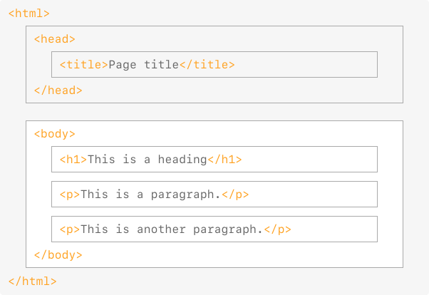
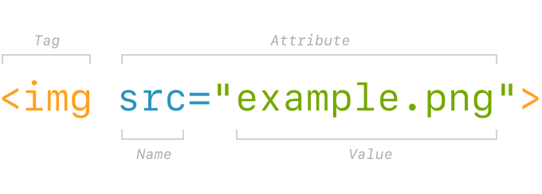
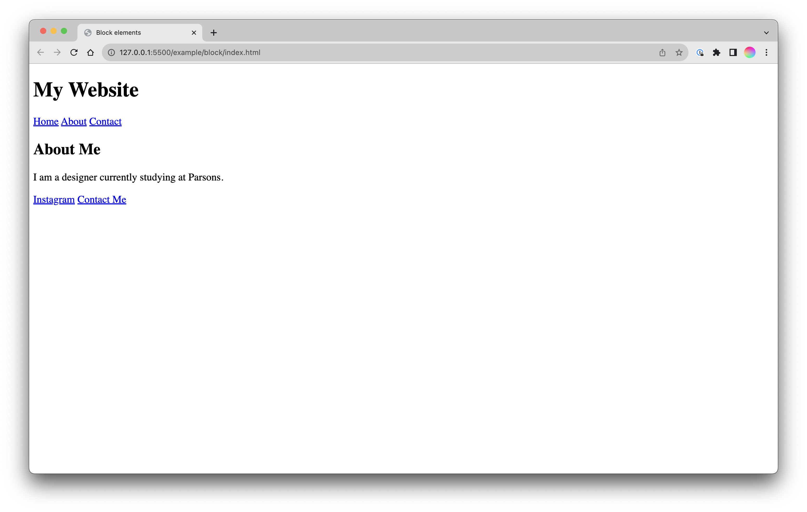
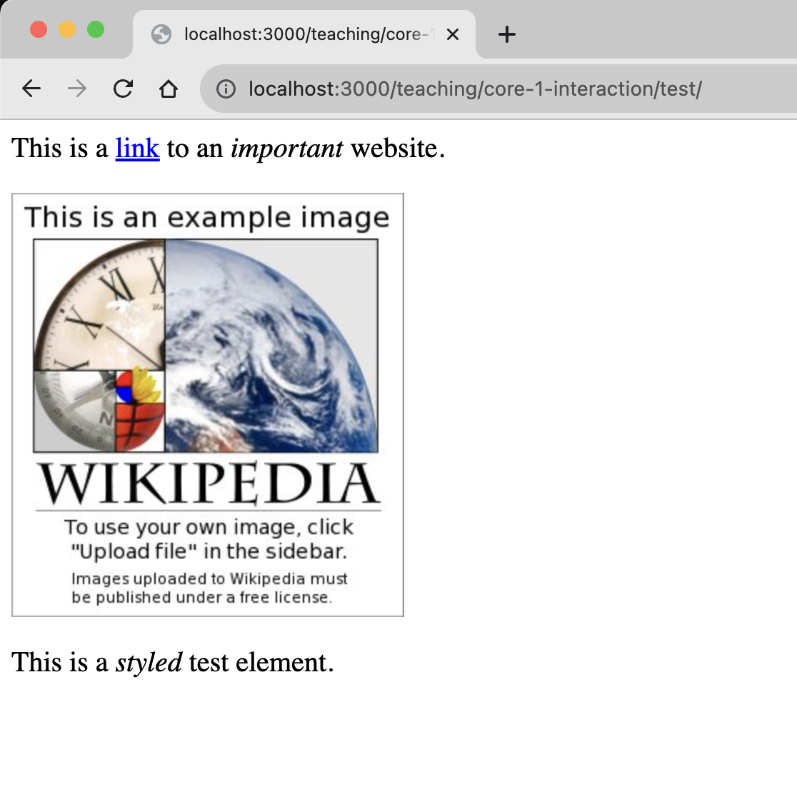

# HyperText Markup Language (HTML)

HTML is the standard markup language/format for creating web pages, containing the content and structure of a page as a series of tags/elements.

* [HTML | MDN](https://developer.mozilla.org/en-US/docs/Web/HTML) \
  *When in doubt, refer to the MDN documentation!*

* [Basics of HTML](https://www.youtube.com/watch?v=CkzbI1Tv_rQ) \
  *A very calming introduction by Laurel Schwulst.*

HTML is the *skeleton* of the web. At its most basic it is a text file, in a folder on a computer, with a `.html` extension.


## The basic document

HTML consists of a [range of elements](https://developer.mozilla.org/en-US/docs/Web/HTML/Element), nested inside one another.

*As a visual:*



*As code:*

```html
<!DOCTYPE html>
<html>
  <head>
    <title>Page title</title>
  </head>
  <body>
    <h1>This is a heading</h1>
    <p>This is a paragraph.</p>
    <p>This is another paragraph.</p>
  </body>
</html>
```

The `<html>` element contains all elements of the page, the `<head>` element contains the title, and the body contains `<h1>` and `<p>`.

We call these [*semantic* elements](https://developer.mozilla.org/en-US/docs/Glossary/Semantics)—which is saying that they give their contents a *meaning* or a *role*. These *roles* are then interpreted by your browser (Chrome, Safari, Firefox, etc.) when it loads the file, to ultimately display the page. We call this *parsing* the document.

*In our example, here is what we’ve told the computer:*

- `<!DOCTYPE html>` \
  What kind of file this is, so it knows how to parse it. \
  *This is not necessary in CSS or JS files.*

- `<html>` \
  The root element of an HTML page, containing all the content.

- `<head>` \
  The *meta* information about the HTML page—like its title, default language, [scripts](https://developer.mozilla.org/en-US/docs/Web/HTML/Element/script), and [stylesheets](https://developer.mozilla.org/en-US/docs/Web/HTML/Element/style). \
  *Nothing in this element is visible on the page itself.*

- `<title>` \
  Specifies a [title](https://developer.mozilla.org/en-US/docs/Web/HTML/Element/title) for the page—which is shown in the browser’s tab, and when it is shared.

- `<body>` \
  Defines the document's body—the container for all the visible contents, such as headings, paragraphs, images, hyperlinks, tables, lists, etc.

- `<h1>` \
  Defines a primary/first-level heading.

- `<p>` \
  Defines a paragraph.

```html
<!DOCTYPE html>
<html>
  <head>
    <title>Page title</title>
  </head>
  <body>
    <h1>This is a heading</h1>
    <p>This is a paragraph.</p>
    <p>This is another paragraph.</p>
  </body>
</html>
```

## What are elements?

[Elements](https://developer.mozilla.org/en-US/docs/Glossary/Element) are composed of tags (opening, closing) and their content:


Some elements do not have any content or children, like `<br>` or ``. These are called [*empty elements*](https://developer.mozilla.org/en-US/docs/Glossary/Empty_element) and do not have a closing tag.

### Common elements

- `<h1>` `<h2>` `<h3>` `<h4>` `<h5>` `<h6>` for headings

```html
<h1>There should only be one first-level heading!</h1>
```

- `<p>` for paragraphs

```html
<p>You should always wrap your text in a paragraph!</p>
```

- `<a>` are links

```html
<a href="https://www.example.com">Links need attributes!</a>
```

The `href` (*H*ypertext *REF*erence) specifies a URL that the link points to, and the tag wraps the visible link text. The `href` can point to another, local HTML file (living in the same directory structure) or an external page. They can also point to specific parts of a page.

- `` are images

```html

```

The `src` can point to a local image file or an external URL! `alt` provides a description for accessibility/screen readers.

- `<header>` `<footer>` `<nav>` `<main>` `<article>` `<section>` `<div>` define areas

These are the structural containers of a website. The names don’t imbue meaning or function directly, but help us organize and think about our content structure. (And again, are helpful for accessibility.)

```html
<body>
  <header>
    <!-- A header. -->
  </header>

  <main>
    <!-- Your main content. -->
  </main>

  <footer>
    <!-- The footer. -->
  </footer>
</body>
```

- `<span>` `<strong>` `<em>` wrap around bits of text, giving them font styling

```html
<p>You may have noticed I like using <em>emphasis</em>.</p>
```

- `ol` `ul`, and `li` build lists

```html
<ul>
  <li><!-- A list item. --></li>
  <li><!-- Another. --></li>
  <li><!-- A third. --></li>
</ul>
```


## Attributes

All HTML elements can have [attributes](https://developer.mozilla.org/en-US/docs/Web/HTML/Attributes), which provide more information about the element:



### Common attributes

- The `href` attribute of `<a>` specifies the URL of the page the link goes to.

```html
<a href="https://www.example.com">Goes to example.com</a>
```

- The `src` attribute of `` specifies the path to the image to be displayed, as above.

```html

```

- The `alt` attribute of `` provides an alternate text for an image, used by screen readers.

```html

```

- The `id` specifies a singular, unique element on a page—for CSS targeting and anchor (scroll, “jump”) links, prepended with `#`.

```html
<h2 id="a-heading-element">A heading element</h2>

<a href="#a-heading-element">Goes to “a heading element”</a>
```

- The `class` attribute provides a selector to hook on to with CSS.

```html
<p class="warning">We’ll get into this soon.</p>
```


## Block elements

[Block-level elements](https://developer.mozilla.org/en-US/docs/Web/HTML/Block-level_elements) always start on a new line, and take up the full width available—stretching out to the left and right of their parent/container. They stack on top of each other. Importantly, block elements can have a top and bottom margin, unlike inline elements.

Earlier, we talked about area-defining elements. All of these area-defining elements are also block elements:

`<header>` `<footer>` `<nav>` `<main>` `<section>` `<div>`

The heading elements (`<h1>`, etc.), and `<p>` tags are also block-level.

All of the above, in typical use:

```html
<!DOCTYPE html>
<html>

  <head>
    <title>Block elements</title>
  </head>

  <body>

    <header>
      <h1>My Website</h1>
      <nav>
        <a href="/">Home</a>
        <a href="/about">About</a>
        <a href="/contact">Contact</a>
      </nav>
    </header>

    <section id="about">
      <h2>About Me</h2>
      <p>I am a designer currently studying at Parsons.</p>
    </section>

    <footer>
      <a href="https://my-instagram-link">Instagram</a>
      <a href="/contact">Contact Me</a>
    </footer>

  </body>

</html>
```



As said earlier in the lecture, HTML is the skeleton and content of the page. It won't look like much without CSS.


## Inline elements

[Inline elements](https://developer.mozilla.org/en-US/docs/Web/HTML/Inline_elements) do *not* start on a new line, and only take up as much width as necessary. I like to think of these as the little metal slugs [from printing](https://en.wikipedia.org/wiki/Slug_(typesetting)). Other text and inline elements will continue to flow around them, and they can wrap to new lines:

`<a>` `<em>` `` `<span>`

Inline elements often exist within block elements:

```html
<p>
  This is a <a href="https://www.example.com">link</a> to an <em>important</em> website.
</p>
<div>
  
</div>
<p>
  This is a <em>styled</em> <span class="blue-text">test</span> element.
</p>
```




## Comments

You can *comment* part of the code and the browser won’t show it. [Comments](https://developer.mozilla.org/en-US/docs/Learn/HTML/Introduction_to_HTML/Getting_started#html_comments) are often used to explain your thinking, organize your code, “turn off” a bit of code, or hide whatever you’d like:

```html
<!-- this is a comment in HTML that will not appear on the page -->

<!--
  You can also make
  a multi-line comment
  like this.
  -->
```

Keep in mind comments are still readable in your source code, so don't put any secrets in there. Nearly every programming language allows comments.

I highly recommend getting into a habit of commenting your code, especially when starting out. If you figure something tricky out, write down why and how you solved it to help you understand and remember. And you’ll often come back to things. Commenting your code is a gift to your future self!
